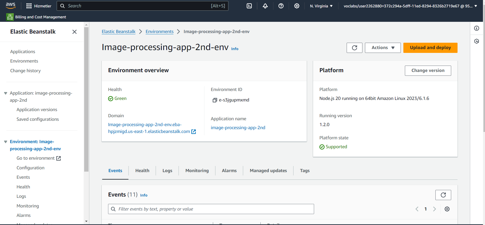
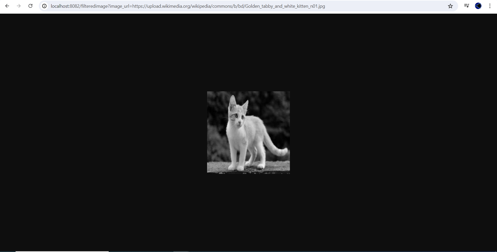
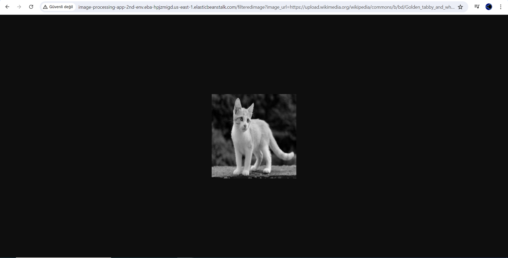

# Full Stack Apps on AWS Project

You have been hired as a software engineer to develop an application that will help the FBI find missing people.  The application will upload images to the FBI cloud database hosted in AWS. This will allow the FBI to run facial recognition software on the images to detect a match. You will be developing a NodeJS server and deploying it on AWS Elastic Beanstalk. 
You will build upon the application we've developed during the lessons in this course. You'll complete a REST API endpoint in a backend service that processes incoming image URLs.

## Testing

Successful URL responses should have a 200 code. Ensure that you include error codes for the scenario that someone uploads something other than an image and for other common errors.

## License

[License](LICENSE.txt)
